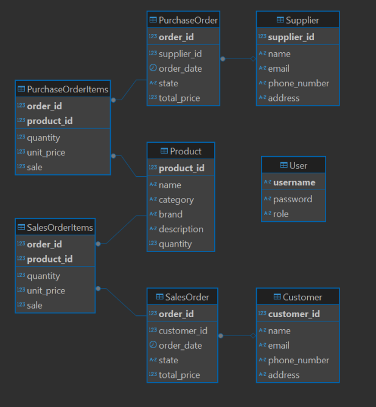

# Inventory Management System

## Overview
The Inventory Management System is a JavaFX-based desktop application designed to manage products, suppliers, customers, and sales/purchases.

- [Project Vision](documents/komeetta_product_vision.pdf)
- [Project Plan](documents/komeetta_project_plan.pdf)

## Technologies Used
- **Java 17** (Maven project)
- **JavaFX** (GUI)
- **MariaDB** (Database)
- **Hibernate JPA** (ORM)
- **JUnit 5** (Testing)
- **JaCoCo** (Code coverage)
- **Docker** (Containerization)
- **Jenkins** (CI/CD pipeline)

## Project Structure
```
com.komeetta.application    # Main application package
com.komeetta.datasource     # Database connection classes
com.komeetta.model          # Entity classes
com.komeetta.dao            # Data access objects
com.komeetta.service        # Service classes (processing sales and purchases)
com.komeetta.controller     # Business logic
com.komeetta.view           # GUI components
```

## Installation & Setup
1. Clone the repository:
   ```sh
   git clone https://github.com/oiivantsov/inventory-management-system.git
   ```
2. Set up the database:
    - Install MariaDB and create a database `sep_inventory`.
    - Update DB connection credentials by editing `.env.example` file. For example:
      ```sh
      JDBC_URL=jdbc:mariadb://localhost:3306/sep_inventory
      JDBC_USER=root
      JDBC_PASSWORD=1234
      TEST_JDBC_URL=jdbc:mariadb://localhost:3306/sep_inventory_test
      TEST_JDBC_USER=root
      TEST_JDBC_PASSWORD=1234
      ```
    - Create `.env` file to set up environment variables:
      ```sh
      cp .env.example .env
      ```
    
3. First Run Database Configuration:
   - Set the following property in `persistence.xml` for the first run to create tables:
     ```xml
     <property name="jakarta.persistence.schema-generation.database.action" value="drop-and-create"/>
     ```
   - After the first run, change it to:
     ```xml
     <property name="jakarta.persistence.schema-generation.database.action" value="none"/>
     ```
   - This ensures that data is not lost on subsequent runs.

4. Build the application:
   ```sh
   mvn clean install -DskipTests
   ```

5. Run the application:
   ```sh
   java -jar .\target\inventory-management-system-1.0-SNAPSHOT.jar
   ```

## Testing
1. Build the project:
   ```sh
   mvn clean install -DskipTests
   ```
2. Run tests:
   ```sh
   mvn test
   ```
3. Generate code coverage report:
   ```sh
   mvn jacoco:report
   ```

### Jenkins Configuration
To enable Docker image push, configure Jenkins with:
1. **Credentials**: Add a Docker Hub credential (`DOCKERHUB_CREDENTIALS_ID`).
2. **Pipeline Setup**: Add the environment variables for database credentials.

## Docker & Deployment
The project includes a Jenkins pipeline to automate build and deployment.
**Note**: The current Docker container does not run properly due to JavaFX compatibility issues.

## Future Improvements
- Improve JavaFX compatibility with Docker.
- Add report functionality
- Enhance error handling and validations.
- Add role-based access control.

## Additional Resources
- **Database Schema**



- **UML Diagram**

[PDF link](documents/uml_v1.pdf)

- **GUI Screenshots** (To be added)

---
This document will be updated as new features are implemented.