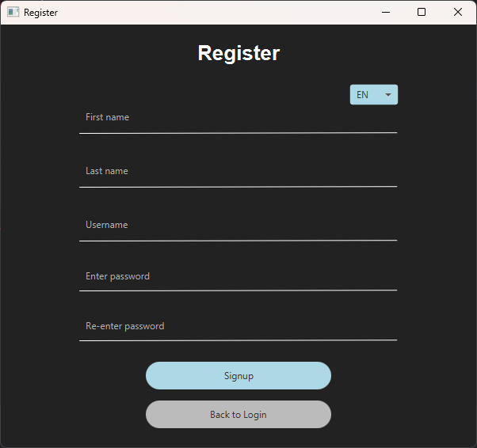
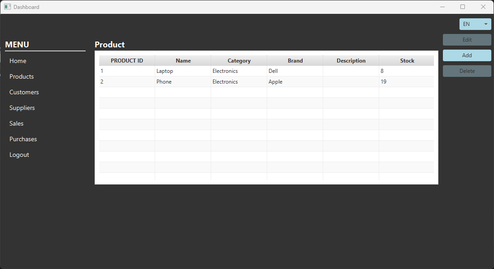
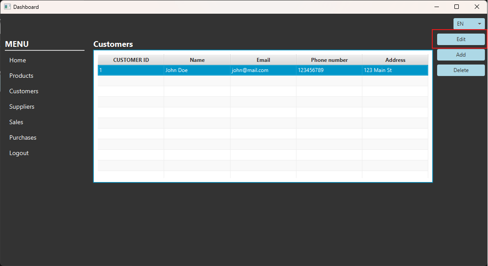
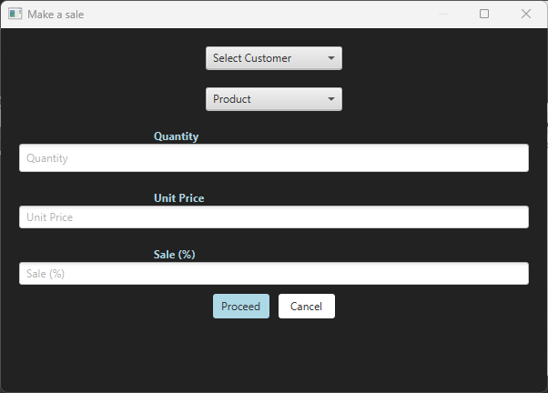
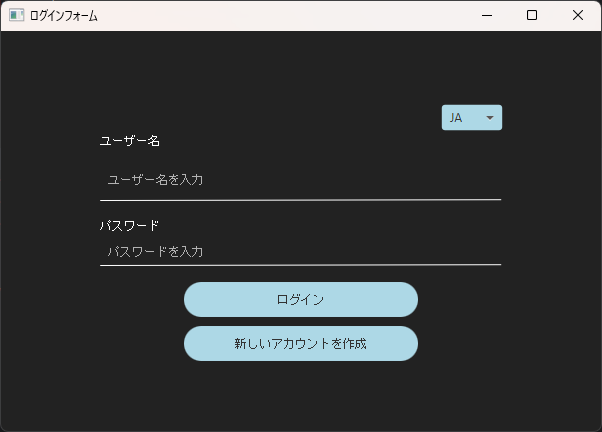

# Inventory Management System

## Table of Contents

- [Overview](#overview)
- [Technologies Used](#technologies-used)
- [CI/CD Pipeline](#cicd-pipeline)
- [Using the GUI](#using-the-gui)
- [Localization Support](#localization-support)
- [Installation & Setup](#installation--setup)
- [Testing](#testing)
- [Code Quality and Static Analysis](#code-quality-and-static-analysis)
- [Usability Evaluation & UAT Testing](#usability-evaluation--uat-testing)
- [Future Improvements](#future-improvements)
- [UML & System Diagrams](#uml--system-diagrams)
- [API Documentation (Javadoc)](#api-documentation-javadoc)

---

## Overview

The **Inventory Management System (IMS)** is a full-featured **JavaFX-based desktop application** developed as part of a software engineering project. It is designed to simplify and streamline the management of key business entities such as **products**, **suppliers**, **customers**, **sales**, and **purchases**.

The system supports:

* Inventory tracking and product updates
* Secure login and user registration functionality
* Intuitive graphical user interface with multi-language support (EN, FI, JA, RU)
* Persistent data storage using **MariaDB** and **Hibernate JPA**
* Automatic localization of product names and interface elements
* Export/import functionality (CSV)
* CI/CD pipeline with Jenkins, SonarQube integration, and Docker containerization

Related Documents
* [Project Vision](documents/OTP1/komeetta_product_vision.pdf) – purpose, target users, and goals
* [Project Plan](documents/OTP1/komeetta_project_plan.pdf) – timeline, responsibilities, technologies, and risks

---

## Technologies Used

* **Java 17** (Maven project)
* **JavaFX** (GUI)
* **MariaDB** (Database)
* **Hibernate JPA** (ORM)
* **JUnit 5** (Testing)
* **JaCoCo** (Code coverage)
* **Docker** (Containerization)
* **Jenkins** (CI/CD pipeline)
* **SonarQube** (Static code analysis)
* **Google Translate API** (Product name localization)

---

## **CI/CD Pipeline**
- The system is integrated with **Jenkins**, which:
  1. Builds the project
  2. Runs tests
  3. Runs code quality analysis
  4. Builds a **Docker image**
  5. Deploys the containerized app

---

## **Using the GUI**

The Inventory Management System provides a user-friendly JavaFX interface for managing products, suppliers, customers, and transactions.

---

### **1. Login / Register**

* **Returning users**: Enter your credentials and click **"Login"**
  
  

* **First-time users**: Click **"Create New Account"** to create an account
  
  

---

### **2. Home Page – Dashboard & Statistics**

After logging in, you will land on the **Home Page**, which includes:

* Real-time statistics: **sales vs. purchases**, **total revenue**, **last three months revenue**
* A **language switcher** to dynamically switch between English, Finnish, Japanese, and Russian
* Buttons to **export reports to CSV** and **import products in bulk from CSV**


* Language switching updates the entire UI instantly
  
  
  
* Export CSV: generates a downloadable sales/purchase report
  
  
  
* Import CSV: allows mass product creation from a spreadsheet

  

---

### **3. Browsing Data**

Use the side menu to view and manage core entities:

* **Customers**
  
  

* **Suppliers**
  
  

* **Products**
  
  

* **Sales**
  
  

* **Purchases**
  
  

---

### **4. Adding & Editing Data**

To add a new entry (Product, Supplier, Customer):

* Click the **"Add"** button
* Fill in the required details
* Click **"Add"** to confirm

To edit existing entries:

* Select an entity
* Click **"Edit"** on the right panel
* Make your changes and save




---

### **5. Recording Transactions**

To create a sale or purchase transaction:

* Navigate to **Sales** or **Purchases**
* Click **"Add"**
* Enter transaction details
* Click **"Proceed"** to complete the transaction




---

### **6. Deleting Data**

You can delete **products**, **customers**, and **suppliers** via the **"Delete"** button.

However:

> ⚠️ **Important:**
> If the entity (e.g. product, customer, or supplier) is already linked to a sale or purchase transaction, it **cannot be deleted directly**.
> You must first **delete the related transactions**, then delete the entity itself.


This ensures **data integrity** and avoids orphaned transaction records.

---

### **7. Logging Out**

Click the **"Logout"** option from the side menu to safely exit the system.


---

## Localization Support

The Inventory Management System supports **localization on two levels**:

### 1. **UI Localization (Multi-Language Interface)**

The application interface is localized using `ResourceBundle`. Supported languages include:

* English (default)
* Finnish (Suomi)
* Japanese (日本語)
* Russian (Русский)

You can **select the language** from the language switcher in the GUI, and the entire application updates dynamically without restart.





---

We maintain a central Excel translation file that contains all UI strings and their translations across languages.
[Translation Table (Excel)](https://github.com/oiivantsov/inventory-management-system/blob/main/documents/localization/localization.xlsx)

### 2. **Database Localization (Translated Product Names)**

The system supports multilingual product names by extending the existing `product` table with dedicated columns for translations. When adding or editing a product, the application:

* Calls an external translation API (e.g., Google Translate API via RapidAPI)
* Automatically translates the product name into **Finnish**, **Japanese**, and **Russian**
* Stores all translations in new columns of the same table

#### Updated `product` Table Example:


This approach simplifies querying and allows the frontend to display product names based on the selected UI language.

---

## Installation & Setup

### 1. Clone the repository:
```sh
git clone https://github.com/oiivantsov/inventory-management-system.git
cd inventory-management-system
```

### 2. Set up the database with Docker:
- To start the **MariaDB** database and the backend application with dummy data, run:
  ```sh
  docker-compose up -d
  ```
  - This starts:
    - **MariaDB container** (`inventory_db` database)
    - **Backend container** (loads dummy data)
  
- If you only need to run **MariaDB** without the backend:
  ```sh
  docker-compose up -d db
  ```

- You can also use the Docker Desktop GUI to manage containers within the `inventory-management-system` setup.

  

### 3. Configure database credentials:
Modify your `.env` file to match the container setup:

1. Copy the example file:
   ```sh
   cp .env.example .env
   ```

2. Ensure that the `.env` file contains the following parameters to connect to the MariaDB container:
   ```sh
   DB_MODE=noreset
   JDBC_URL=jdbc:mariadb://localhost:3308/inventory_db
   JDBC_USER=app_user
   JDBC_PASSWORD=1234
   ```

### 4. First-Time Database Setup:
- The first container run initializes the database with:
  - **2 products**
  - **1 customer**
  - **1 supplier**
  - **1 sale transaction**
  - **1 purchase transaction**

### 5. Build & Run the Application:
1. **Build the JavaFX application**:
   ```sh
   mvn clean install -DskipTests
   ```
2. **Run the JavaFX InventoryManager**:

   ```sh
   java -jar .\target\inventory-management-system-1.0-SNAPSHOT.jar
   ```

   - Open the GUI and register an account.

3. If you need to **reset the database**, update `.env`:
     ```sh
     DB_MODE=reset
     ```
     Then repeat steps 1 and 2.

---

## Testing
0. **Ensure that the database is running** before running tests.

    - Use `.env` file to configure the test database connection parameters. For example:

    ```sh
    TEST_JDBC_URL=jdbc:mariadb://localhost:3306/sep_inventory_test
    TEST_JDBC_USER=root
    TEST_JDBC_PASSWORD=1234
    ```

  - Ensure that the database is created before running tests.

1. Build the project:
   ```sh
   mvn clean install -DskipTests
   ```
2. Run tests:
   ```sh
   mvn test
   ```
3. Generate code coverage report:
   ```sh
   mvn jacoco:report
   ```

---

## Code Quality and Static Analysis

The project integrates **SonarQube** for continuous code quality analysis, integrated directly into the **Jenkins CI/CD pipeline**.

### SonarQube Integration

Code is automatically analyzed with every commit through the following Jenkins stage:

```groovy
stage('SonarQube Analysis') {
    steps {
        withSonarQubeEnv('SonarQubeServer') {
            bat """
                sonar-scanner.bat ^
                -Dsonar.projectKey=komeetta ^
                -Dsonar.sources=src ^
                -Dsonar.projectName=inventory ^
                -Dsonar.host.url=http://localhost:9000 ^
                -Dsonar.login=${env.SONAR_TOKEN} ^
                -Dsonar.java.binaries=target/classes
            """
        }
    }
}
```

### Sample Code Review Report

A snapshot report from one of the sprints is available as an example of early code quality analysis:

**[Sprint 6 Code Review Report (Example)](https://github.com/oiivantsov/inventory-management-system/blob/main/documents/code_review/sprint6_code_review_report_start.md)**

**Note:**
This report was generated *before* major code cleanup and test improvements. Since then, several issues, such as high duplication and complexity, have been addressed through active refactoring.

---

## Usability Evaluation & UAT Testing

As part of Sprint 7, we conducted a full usability evaluation and **User Acceptance Testing (UAT)** to assess the quality of our app.

### Heuristic Evaluation (Jakob Nielsen’s 10 Usability Heuristics)

Each team member independently reviewed the application against Nielsen’s 10 usability heuristics and documented findings in structured reports. We then consolidated the results into a shared summary.

**Individual reports:**

* [Heuristic Evaluation – Eetu](https://github.com/oiivantsov/inventory-management-system/blob/main/documents/usability_testing/heuristic_evaluation_reports/heuristic_evaluation_report_eetu.md)
* [Heuristic Evaluation – Oleg](https://github.com/oiivantsov/inventory-management-system/blob/main/documents/usability_testing/heuristic_evaluation_reports/heuristic_evaluation_report_oleg.md)

Issues were categorized by severity and included suggested improvements. Several key issues were resolved during Sprint 8.

---

### User Acceptance Testing (UAT)

We acted as customer representatives and executed real test cases based on product requirements to simulate realistic user scenarios.

* **Test cases defined:**
  [IMS\_TestCases.xlsx](https://github.com/oiivantsov/inventory-management-system/blob/main/documents/usability_testing/IMS_TestCases.xlsx)

* **UAT result summary:**
  [UAT-result report (PDF)](https://github.com/oiivantsov/inventory-management-system/blob/main/documents/usability_testing/UAT-result%20report.pdf)

Bugs and usability issues discovered during UAT were logged, prioritized, and fixed to prepare the project for the final Sprint 8 and Future Improvements.

---

## Future Improvements

* Add real-time UI validation and feedback for better user experience
* Add tooltips, labels, and better help messages
* Add keyboard shortcuts for common actions (e.g., Ctrl+N = Add)
* Enable potential integration with company systems (e.g., ERP, external APIs) for real-world deployment and scalability

---

## UML & System Diagrams

> Note: Some diagrams were created in Finnish as part of a local university course.

* **Database Schema**
  
  

* **ER Diagram (Inventory DB)**
  
  

* **UML Class Diagram**
  
  

* **Use Case Diagram**
  
  

* **Sequence Diagram**
  
  

* **Activity Diagram – Selling Process**
  
  

* **Deployment Diagram**
  
  

---

## API Documentation (Javadoc)

The Inventory Management System includes **auto-generated Javadoc** for all public classes and methods.

You can access the documentation here:

**[View Javadoc](https://users.metropolia.fi/~olegiv/invetory_manager/)**

---
This document will be updated as new features are implemented.
