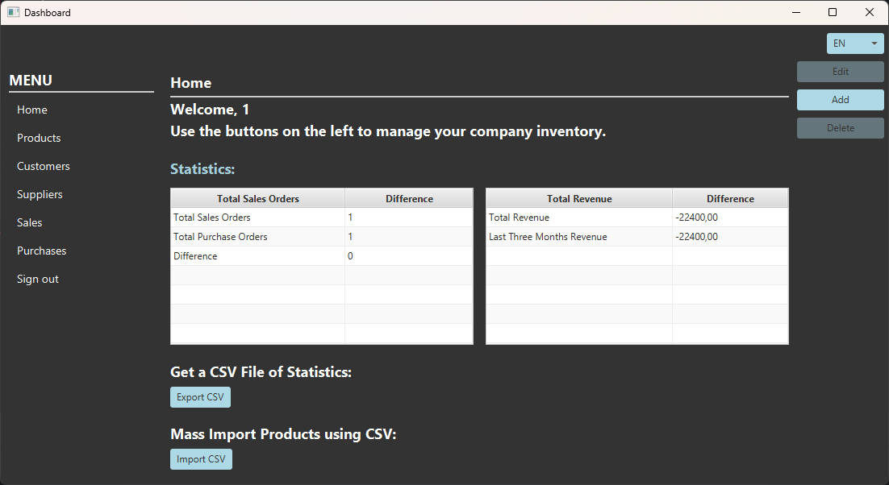
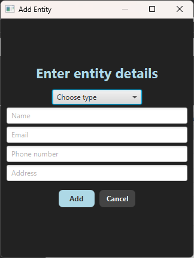

# Inventory Management System

## Overview
The Inventory Management System is a JavaFX-based desktop application designed to manage products, suppliers, customers, and sales/purchases.

- [Project Vision](documents/komeetta_product_vision.pdf)
- [Project Plan](documents/komeetta_project_plan.pdf)

---

## Technologies Used
- **Java 17** (Maven project)
- **JavaFX** (GUI)
- **MariaDB** (Database)
- **Hibernate JPA** (ORM)
- **JUnit 5** (Testing)
- **JaCoCo** (Code coverage)
- **Docker** (Containerization)
- **Jenkins** (CI/CD pipeline)

---

## **CI/CD Pipeline**
- The system is integrated with **Jenkins**, which:
  1. Builds the project
  2. Runs tests
  3. Builds a **Docker image**
  4. Deploys the containerized app

---

## Project Structure
```
com.komeetta.application    # Main application package
com.komeetta.datasource     # Database connection classes
com.komeetta.model          # Entity classes
com.komeetta.dao            # Data access objects
com.komeetta.service        # Service classes (processing sales and purchases)
com.komeetta.controller     # Business logic
com.komeetta.view           # GUI components
```

---

## **Using the GUI**

The Inventory Management System provides a user-friendly JavaFX interface for managing products, suppliers, customers, and transactions.

### **1. Login / Register**

- **Returning users**: Enter your credentials and click **"Login"**.


- **First-time users**: Click **"Create New Account"** to create an account.


### **2. Home Page – Checking Stock Statistics**
- Upon login, you will land on the **Home Page**, which displays an overview of:
  - **Sales and Purchases statistics**
  - **Revenue statistics (incl. last 3 months)**



### **3. Browsing Data**
- Navigate through the application to view detailed information:
  - **Customers** – View and manage registered customers.

   

  - **Suppliers** – List all suppliers and their details.

   

  - **Products** – See all available products and stock levels.

   

  - **Sales** – View previous sales transactions.

   

  - **Purchases** – Track purchase records.

   

### **4. Adding Data**
- To add new entries:
  - Click the **"Add"** button on the **Customers, Suppliers, or Products** page to add a new customer, supplier, or product.
  - Enter the required details and click **"Add"**.

   

  - You can also modify the data by selecting an entity and clicking the "Edit" button on the right.

   


### **5. Making Sales or Purchase Transactions**
- To record a sale or purchase:
  - Go to the **Sales** or **Purchases** page.
  - Click the **"Add"** button.
  - Enter the required details and click **"Proceed"**.


### **6. Logging Out**
- To **log out**, click the **"Logout"** button in the navigation menu.

---

## Installation & Setup

### 1. Clone the repository:
```sh
git clone https://github.com/oiivantsov/inventory-management-system.git
cd inventory-management-system
```

### 2. Set up the database with Docker:
- To start the **MariaDB** database and the backend application with dummy data, run:
  ```sh
  docker-compose up -d
  ```
  - This starts:
    - **MariaDB container** (`inventory_db` database)
    - **Backend container** (loads dummy data)
  
- If you only need to run **MariaDB** without the backend:
  ```sh
  docker-compose up -d db
  ```

- You can also use the Docker Desktop GUI to manage containers within the `inventory-management-system` setup.

  

### 3. Configure database credentials:
Modify your `.env` file to match the container setup:

1. Copy the example file:
   ```sh
   cp .env.example .env
   ```

2. Ensure that the `.env` file contains the following parameters to connect to the MariaDB container:
   ```sh
   DB_MODE=noreset
   JDBC_URL=jdbc:mariadb://localhost:3308/inventory_db
   JDBC_USER=app_user
   JDBC_PASSWORD=1234
   ```

### 4. First-Time Database Setup:
- The first container run initializes the database with:
  - **2 products**
  - **1 customer**
  - **1 supplier**
  - **1 sale transaction**
  - **1 purchase transaction**

### 5. Build & Run the Application:
1. **Build the JavaFX application**:
   ```sh
   mvn clean install -DskipTests
   ```
2. **Run the JavaFX InventoryManager**:

   ```sh
   java -jar .\target\inventory-management-system-1.0-SNAPSHOT.jar
   ```

   - Open the GUI and register an account.

3. If you need to **reset the database**, update `.env`:
     ```sh
     DB_MODE=reset
     ```
     Then repeat steps 1 and 2.

---

## Testing
1. Build the project:
   ```sh
   mvn clean install -DskipTests
   ```
2. Run tests:
   ```sh
   mvn test
   ```
3. Generate code coverage report:
   ```sh
   mvn jacoco:report
   ```

---


## Future Improvements
- Enhance error handling and validations.
- Add role-based access control.
- Explore sales and purchases transactions.

## Additional Resources
- **Database Schema**


- **UML Diagram**

[PDF link](documents/uml_v1.pdf)

---
This document will be updated as new features are implemented.