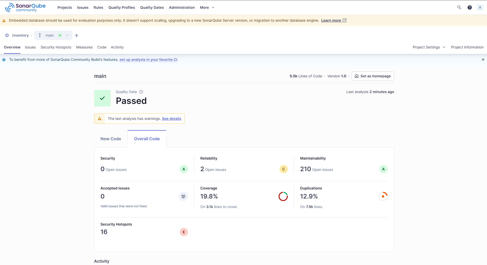
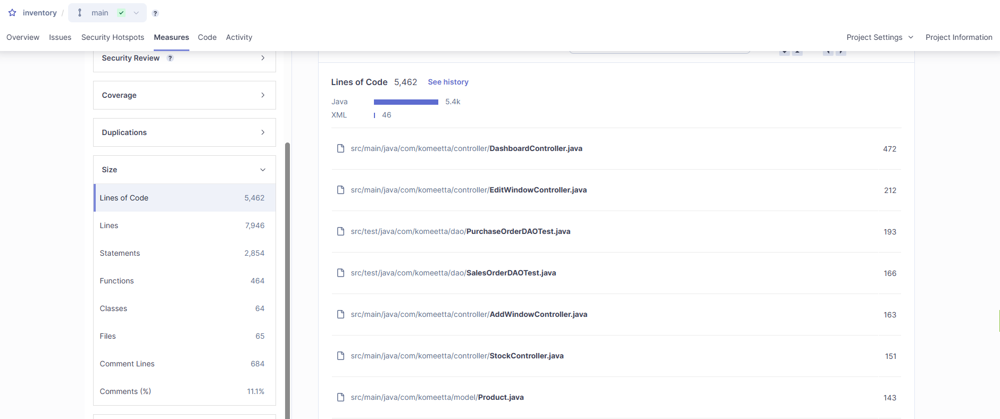
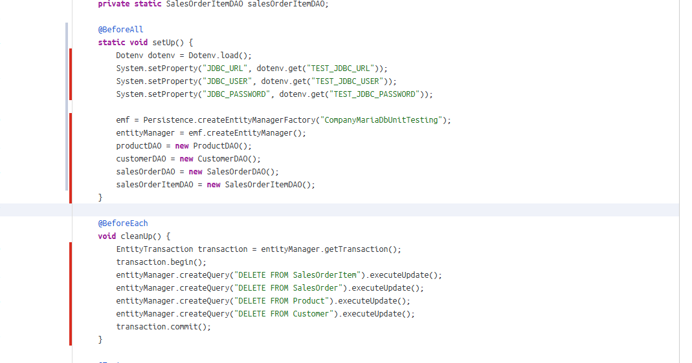
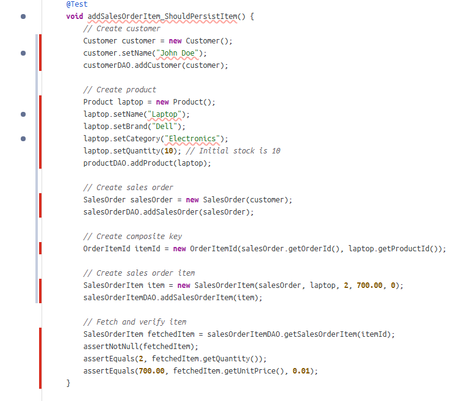
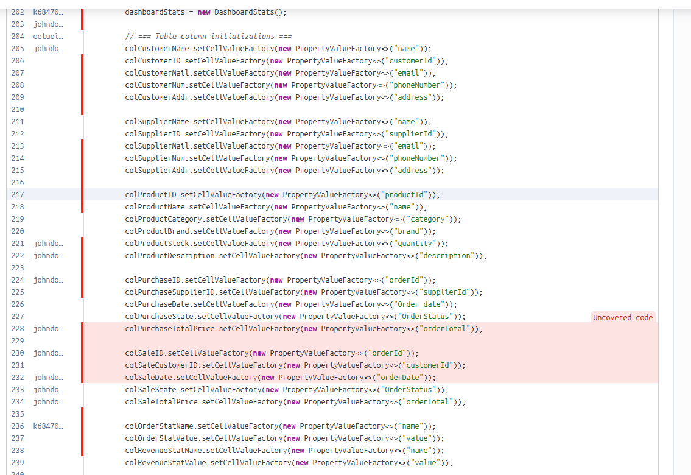

# Sprint 6 Report: Code Review, Code Clean-Up & Acceptance Test Plan

**Note:** This report was generated before code refactoring and test improvements. All findings and metrics reflect the current state of the codebase prior to clean-up actions and acceptance test implementation. The upcoming refactoring will address the identified issues such as high complexity or code duplication.

## Statistical Code Review

### Static Analysis Overview (SonarQube)

| Metric                        | Value      | Notes |
|------------------------------|------------|-------|
| **Lines of Code**            | 5,462      | Medium-sized codebase |
| **Statements**               | 2,854      | Logic-heavy project |
| **Functions**                | 464        | Average ~12 lines per function |
| **Classes / Files**          | 64 / 65    | Good class-to-file structure |
| **Comments (%)**             | 11.1%      | Satisfactory documentation level, will be higher as we will add documentation |
| **Cyclomatic Complexity**    | 710        | Quite high — requires refactoring in specific files |
| **Cognitive Complexity**     | 276        | Acceptable, the lower the better |
| **Duplicated Lines**         | 1,022 (12.9%) | High duplication — must be reduced |
| **Code Coverage**            | 19.8%      | Low but OK — GUI and view modules are not covered as they are JavaFX based |
| **Security Issues**          | 0          | Clean and safe |

### Complexity Hotspots

#### Cyclomatic Complexity (Top 5 Files)
| File                                     | Score |
|------------------------------------------|-------|
| `DashboardController.java`               | 78    |
| `Product.java`                           | 33    |
| `EditWindowController.java`              | 27    |
| `EntityController.java`                  | 23    |
| `StockController.java`                   | 23    |

#### Cognitive Complexity (Top 5 Files)
| File                                     | Score |
|------------------------------------------|-------|
| `DashboardController.java`               | 54    |
| `ProductDAO.java`                        | 25    |
| `EditWindowController.java`              | 23    |
| `SignupController.java`                  | 22    |
| `EntityController.java`                  | 18    |

### Summary of Issues

- High code duplication (12.9%) — refactor repeated logic.

    - For example, a lot of tests contains the same DB connection logic

    

    or logic for creating test-entitites

    

- Critical complexity in `DashboardController.java` — consider splitting into smaller methods.

    - For example here we can find simplify the logic for creating tables

    

---

## Code Clean-Up Plan

### Refactoring Strategy

- Refactor long and complex methods in top files (especially `DashboardController.java`, `Product.java`, and `ProductDAO.java`).
- Reduce duplicated logic across the 23 duplicated files and 53 blocks.
- Simplify method names and parameters where needed.

### Verification

- All refactoring changes will be pushed to GitHub.
- Run all unit tests to ensure stability and correctness.
- Perform manual regression testing on key features after refactoring.

---

## Acceptance Test Plan

### Acceptance Criteria

- The user must be able to add and edit entities (e.g., products, orders).
- The application must persist data across sessions - we use DB.
- The UI must update live upon data changes - for example, language changing.
- Error messages must be clear and actionable.
- The system must not crash on invalid input or empty fields.

### Acceptance Tests (To Be Conducted)

#### Functional Tests
| Test Case                           | Expected Result                      |
|------------------------------------|--------------------------------------|
| Add new product                    | Product appears in table             |
| Edit existing entity               | Changes persist and reflect in UI    |
| Delete entity                      | Entity is removed from DB and UI     |

#### Usability Tests
- User is able to navigate the system without documentation.
- All buttons are visible and labelled clearly.
- Responsive layout tested on desktop and laptop.

#### Performance Tests
- Application loads in under 2-3 seconds.
- No noticeable lag when switching views or saving changes.