# Heuristic Evaluation Report

## Evaluator Information
- **Name:** Oleg I
- **Date:** 29.04.2024
- **Project:** Inventory Management System
- **Sprint:** Sprint 7

## Evaluation Method
Each screen of the application was evaluated individually using Jakob Nielsen's 10 usability heuristics. Problems were documented, severity ratings assigned, and suggested improvements proposed.

## Severity Rating Scale
| Rating | Description |
|:------:|:------------|
| 0 | No usability problem |
| 1 | Cosmetic problem only |
| 2 | Minor usability problem |
| 3 | Major usability problem (important to fix) |
| 4 | Usability catastrophe (imperative to fix) |

---

# Heuristic Evaluation by Principle

## H1-1: Simple & Natural Dialog
**Description of Issue:**
On the "Total Purchase Orders" page, the column names "ORDER ID" and "SUPPLIER ID" are technical and database-oriented. Ordinary users would better understand more natural labels like "Order Number" and "Supplier Name". Similarly, "Order State" sounds slightly technical; "Order Status" would feel more natural.

**Screenshot:**

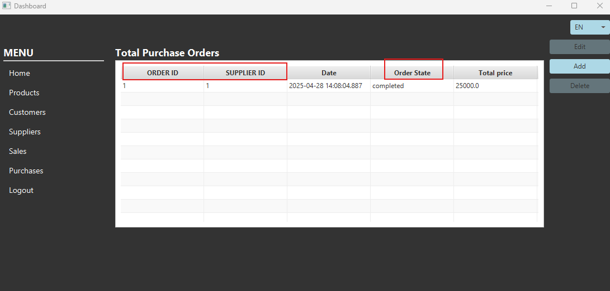

**Severity:**
2 - Minor usability problem (might confuse non-technical users but doesn't block functionality).

**Suggested Improvement:**

- Change "ORDER ID" → "Order Number"
- Change "SUPPLIER ID" → "Supplier"
- Change "Order State" → "Order Status"

---

## H1-2: Speak the Users' Language
**Description of Issue:**
The application supports multiple languages and correctly translates the main menu, table headers, and button labels based on the selected language (e.g., Finnish "FI" selected: "VALIKKO", "Tuote", "Muokkaa").

**Screenshot:**
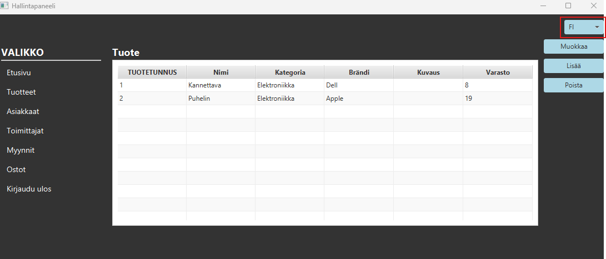

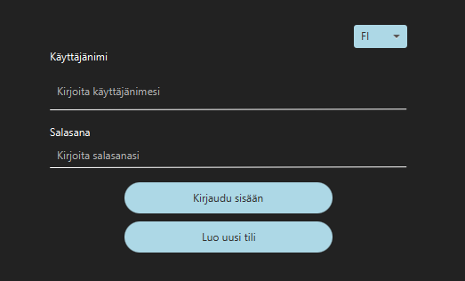

**Severity:**
0 - No usability problem

**Suggested Improvement:**
No changes needed; the language is appropriately localized.

---

## H1-3: Minimize Users' Memory Load
**Description of Issue:**
When attempting to delete a product/customer/supplier that is part of a transaction, the system only displays a generic message (for example, "Product participates in a transaction") without specifying which transaction(s) the product is involved in.

Additionally, on the Sales and Purchase Order pages, product names and related customer/supplier details are not shown directly in the transaction table.

**Screenshot:**

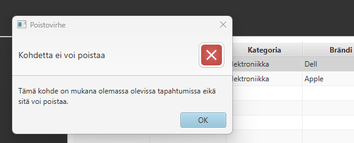

**Severity:**
3 – Major usability problem (important to fix).

**Suggested Improvement:**
- Modify the error message to list the transaction types and IDs where the product is involved.
  - Example: "Cannot delete. Product is linked to Sales Order #12, Purchase Order #5."
- In Sales and Purchase Order tables, display the product name and customer/supplier names directly instead of only IDs
  - Example: Add a simple right-click or button option
---

## H1-4: Consistency
**Description of Issue:**
On the Sales Orders ("Myyntitilaukset") page, there are inconsistencies in the capitalization and language usage:
- Column headers like "TILAUKSEN ID" and "ASIAKKAAN ID" are in all caps, while other columns like "Päivämäärä", "Tilauksen tila", and "Kokonais­hinta" use Title Case (capitalized first letter only).

**Screenshot:**
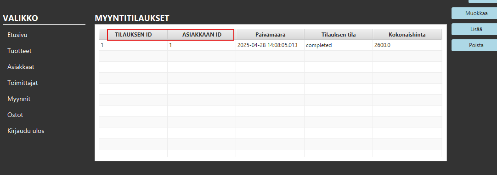

**Severity:**
2 – Minor usability problem (affects user perception but not functionality).

**Suggested Improvement:**
- Use consistent casing across all table headers (preferably Title Case, e.g., "Tilauksen ID", "Asiakkaan ID").
- Apply a common style guide for table and field labels across all pages.

---

## H1-5: Feedback
**Description of Issue:**
Description of Issue:
The application provides essential feedback for critical user actions:
- for example, when deleting a product, a confirmation dialog appears asking "Are you sure you want to delete this Product?"
- after successful registration, a success message appears welcoming the user.

However, the feedback could be made more precise:
- The deletion confirmation could specify which product is being deleted (e.g., show product name).
- The success message after registration uses a generic "Message" title, which can be improved to be more descriptive.

**Screenshot:**

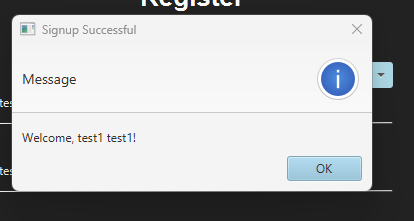

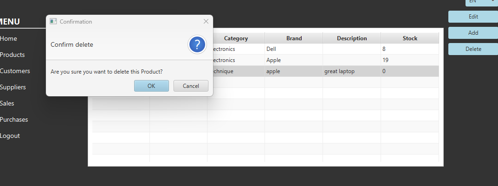

**Severity:**
2 – Minor usability problem (good feedback exists, but it could be improved for clarity).

**Suggested Improvement:**
- In the delete confirmation, show the product name directly (e.g., "Are you sure you want to delete 'Laptop Dell'?").
- Change the title of the signup success pop-up from generic "Message" to something more specific, like "Registration Successful".

---

## H1-6: Clearly Marked Exits
**Description of Issue:**
When a user selects "Create New Account" on the login screen, they are redirected to the registration page.
However, there is no visible option (such as a "Back to Login" button or link) to return to the login page without completing the registration process.
This limits user control and makes navigation less flexible, especially if a user changes their mind or selected the wrong option by mistake.

**Screenshot:**
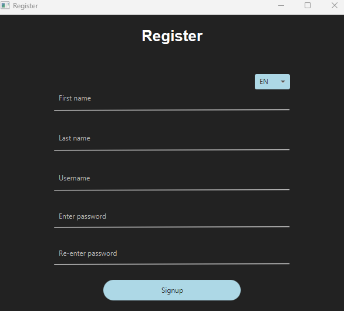

**Severity:**
2 – Minor usability problem (affects user control but does not block application functionality).

**Suggested Improvement:**
- Add a simple "Back to Login" button or link on the registration page, allowing users to return to the login screen without completing registration.

---

## H1-7: Shortcuts
**Description of Issue:**
Currently, all navigation and actions in the application must be performed manually using the mouse.
There are no keyboard shortcuts for common operations like adding a new product, saving changes, or navigating between sections (e.g., Home, Products, Customers).
This design slows down experienced users who could complete tasks faster with shortcut support.

**Screenshot:**
Not applicable

**Severity:**
2 – Minor usability problem (affects efficiency for experienced users but not critical for basic use).

**Suggested Improvement:**
Introduce basic keyboard shortcuts, such as:
- Ctrl+N → Add New Product
- Ctrl+E → Edit Selected Product
- Ctrl+1, Ctrl+2, Ctrl+3 → Quick navigation between Home, Products, Customers, etc.
---

## H1-8: Precise & Constructive Error Messages
**Description of Issue:**
When attempting to delete a product that is associated with existing transactions, the system displays a generic error message:
- "Product participates in a transaction."

However, the message does not specify:
- Which transactions the product is involved in (sales or purchases).
- What the user can do next (e.g., "Please delete the transactions first" or "View linked transactions").

As a result, the user is left guessing and has to manually investigate the situation, which can lead to confusion or errors.

**Screenshot:**
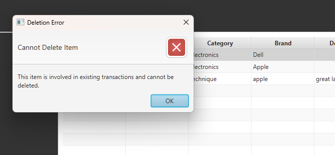

**Severity:**
3 – Major usability problem (important to fix to guide the user correctly).

**Suggested Improvement:**
- Make the error message specific:
  - Example: "Cannot delete product. It is linked to Sales Order #12 and Purchase Order #5."
- Suggest the next action clearly:
  - Example: "Please delete or update the related transactions before attempting to delete this product."
- If possible, provide a direct link to view the related transactions.

---

## H1-9: Prevent Errors
**Description of Issue:**
### Problem 1
Currently, the system allows the user to attempt to delete a product even if it is linked to existing transactions.
The error is only discovered after the user initiates the deletion action, resulting in an error message.
This approach forces users into avoidable mistakes, requiring unnecessary extra steps and investigation afterward.

### Problem 2
The application validates user input for phone numbers and emails only after the user tries to submit the form (e.g., adding a new customer or supplier).
For example:
- If an invalid phone number is entered, a message appears: "Phone number must be between 10-15 digits."
- If an invalid email is entered, a message appears: "Please enter a valid email address."

However, these validations happen only after clicking the "Add" button, not in real-time.

This allows invalid data entry during the form-filling phase and forces users to correct mistakes after submission attempts, which could be prevented earlier.

**Screenshot:**
### Problem 1
Not applicable

### Problem 2
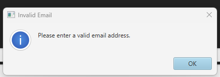

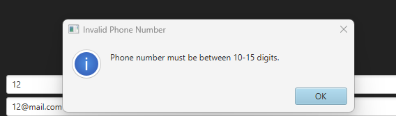

**Severity:**
### Problem 1
3 – Major usability problem (important to fix to prevent common user errors).

### Problem 2
2 – Minor usability problem (errors are caught, but late in the process, causing extra steps).

**Suggested Improvement:**
### Problem 1
- Disable the delete button or option for products that are involved in active transactions.
- Alternatively, show a pre-deletion warning popup immediately when the user clicks "Delete" stating:
  - "This product is linked to existing sales or purchase transactions and cannot be deleted."
- Provide an option like "View Linked Transactions" directly from the warning message, so the user can check and act accordingly.

### Problem 2
- Provide inline hints below fields (e.g., "Phone number must be 10-15 digits") to reduce errors proactively.
---

## H1-10: Help and Documentation
**Description of Issue:**
The application provides a very basic form of guidance on the Home page:
- "Use the buttons on the left to manage your company inventory."
This minimal instruction helps users understand the main navigation concept.

However, there is no additional help or documentation covering:
- How to add, edit, or delete products, customers, or suppliers.
- Field validation rules (e.g., phone number format, required fields).
- How sales and purchases workflows operate.

Thus, users must rely on trial and error to fully understand the system beyond the initial Home page tip.

**Screenshot:**
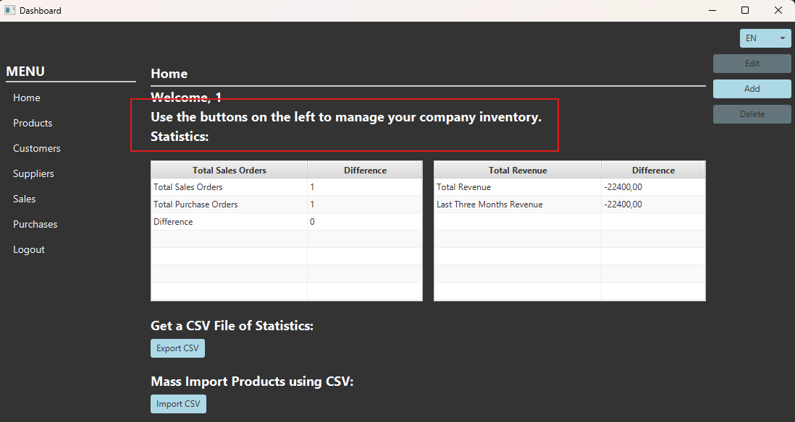

**Severity:**
2 – Minor usability problem (basic help is present but insufficient for full guidance).

**Suggested Improvement:**
- Expand the Home page guidance by adding links to short tutorials or simple FAQs.
- Add tooltips or hints next to important fields and buttons (e.g., "Click here to add a new customer").
- Create a minimal "Help" or "Instructions" section in the sidebar or footer explaining basic operations.

---

## Summary of Findings
- **Major issues:**
  - Missing detailed error messages and guidance when deleting products linked to transactions (H1-8, H1-9).
  - Users must memorize IDs and manually navigate across tabs (H1-3).
- **Minor issues:**
  - Inconsistent naming and capitalization in tables (H1-4).
  - Lack of shortcuts for power users (H1-7).
  - Lack of real-time validation feedback during form filling (H1-9).
  - Missing "Back to Login" option on the registration page (H1-6).
  - Minimal help and documentation available (H1-10).

- **Cosmetic issues:**
  - Minor inconsistencies in language phrasing and field labels (H1-1, H1-2). 

## Recommendations
- Improve error messages by making them more precise and actionable.
- Prevent common errors proactively, such as blocking deletion of linked products.
- Add missing navigation options like "Back to Login" for better flow control.
- Introduce real-time field validation and inline hints during form completion.
- Standardize UI elements like button names and table headers across all pages.
- Implement basic keyboard shortcuts for frequent operations.
- Expand user guidance through tooltips, field hints, or a lightweight Help section.
