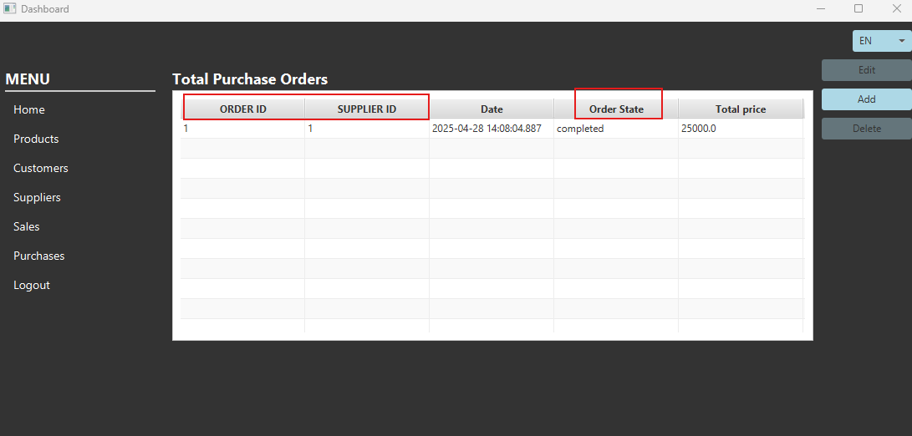
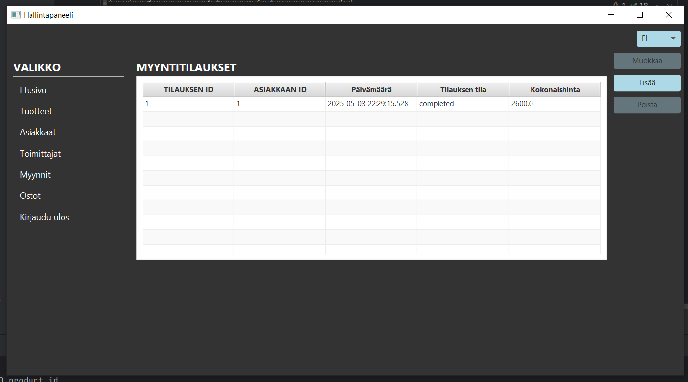
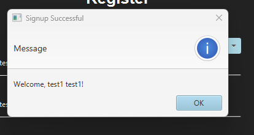
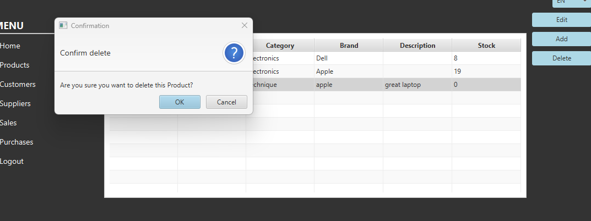
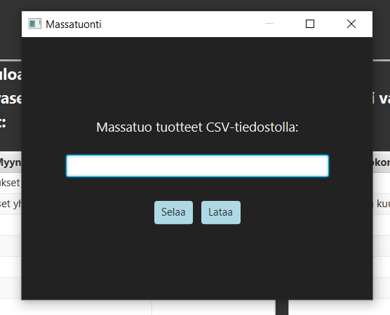
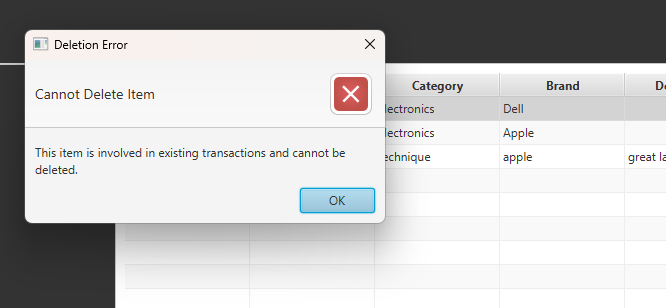
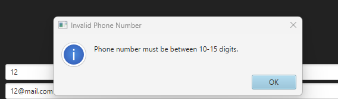
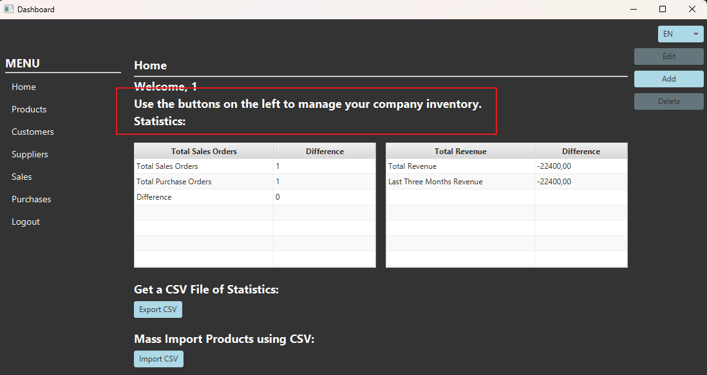

# Heuristic Evaluation Report

## Evaluator Information

* **Name:** Eetu Oinonen
* **Date:** 02.05.2025
* **Project:** Inventory Management System
* **Sprint:** Sprint 8

## Evaluation Method

Each screen of the application was evaluated individually using Jakob Nielsen's 10 usability heuristics. Identified issues were documented, severity ratings were assigned, and suggestions for improvement were proposed.

## Severity Rating Scale

| Rating | Description                                 |
| :----: | :------------------------------------------ |
|    0   | No usability problem                        |
|    1   | Cosmetic issue only                         |
|    2   | Minor usability issue                       |
|    3   | Major usability issue (should be addressed) |
|    4   | Critical usability issue (must be fixed)    |

---

# Heuristic Evaluation by Principle

## H1-1: Simple & Natural Dialog

**Issue Description:**
On the "Purchases" page, column headers such as "ORDER ID" and "SUPPLIER ID" use technical, database-oriented terminology. This may be unclear to non-technical users. Additionally, the "Date" column displays time down to milliseconds, which is excessive for typical users.

**Screenshot:**

**Severity:**
2 – Minor usability issue

**Suggested Improvement:**

* Trim the Date format (e.g., display as "2025-03-03 17:05").
* Replace "SUPPLIER ID" with "Supplier Name".
* Replace "ORDER ID" with "Order Number".

---

## H1-2: Speak the Users' Language

**Issue Description:**
When editing a product, the confirmation message appears in English, even though Finnish is selected as the language.

**Screenshots:**

**Severity:**
2 – Minor usability issue

**Suggested Improvement:**
Ensure that all confirmation messages are localized based on the selected language using a resource bundle.

---

## H1-3: Minimize Users' Memory Load

**Issue Description:**
In the "Add Entity" form, the textareas lack labels, making it unclear what information should be entered without manually deleting placeholder text.

**Screenshot:**

**Severity:**
3 – Major usability issue

**Suggested Improvement:**

* Add clear labels above each input field in the form.

---

## H1-4: Consistency

**Issue Description:**
On the sign-in page, the window title reads "Login form," whereas error messages use "Sign in failed." This inconsistency in terminology may confuse users.

**Screenshot:**

**Severity:**
1 – Cosmetic issue

**Suggested Improvement:**

* Use consistent terminology by standardizing all references to "Sign in."

---

## H1-5: Feedback

**Issue Description:**
The system gives basic feedback for key actions, such as confirming deletions or successful registration. However, these could be more descriptive:

* The deletion confirmation should name the product.
* The registration success popup is labeled generically as "Message."
* Failed sign-in attempts display an informational blue icon rather than an error-specific red one.

**Screenshots:**

**Severity:**
2 – Minor usability issue

**Suggested Improvement:**

* Display the product name in deletion confirmation dialogs.
* Change the registration popup title to "Registration Successful."
* Replace the info icon and blue message with a red error icon for failed sign-ins.

---

## H1-6: Clearly Marked Exits

**Issue Description:**
When initiating a CSV import from the Home screen, the user is shown a popup without any visible option to cancel the operation besides the window's close button.

**Screenshot:**

**Severity:**
2 – Minor usability issue

**Suggested Improvement:**

* Include a clearly visible "Cancel" button in the CSV import popup window.

---

## H1-7: Shortcuts

**Issue Description:**
There are no keyboard shortcuts for common tasks like adding a product or navigating between sections. This slows down experienced users.

**Screenshot:**
Not applicable

**Severity:**
2 – Minor usability issue

**Suggested Improvement:**
Add keyboard shortcuts, such as:

* Ctrl+N → Add new item
* Ctrl+E → Edit selected item
* Ctrl+1/2/3 → Navigate between sections

---

## H1-8: Precise & Constructive Error Messages

**Issue Description:**
Attempting to delete a product tied to transactions yields a generic error message: "Product participates in a transaction." This lacks specifics and doesn't offer next steps.

**Screenshot:**

**Severity:**
3 – Major usability issue

**Suggested Improvement:**

* Make error messages specific (e.g., reference sales or purchase order IDs).
* Provide actionable guidance (e.g., "Please delete related transactions first.").
* Link to related transactions if possible.

---

## H1-9: Prevent Errors

**Problem 1:** After changing the language, edit and delete buttons remain active even without a selected entity.
**Problem 2:** Validation for phone numbers and emails occurs only after form submission, not during input.

**Screenshots:**

**Severity:**

* Problem 1: 3 – Major usability issue
* Problem 2: 2 – Minor usability issue

**Suggested Improvement:**

* Problem 1: Disable edit/delete buttons until an item is selected.
* Problem 2: Implement real-time validation and show inline hints (e.g., "Phone number must be 10–15 digits").

---

## H1-10: Help and Documentation

**Issue Description:**
The Home page provides a brief instruction, but there's no comprehensive documentation to guide users through core tasks or validation rules.

**Screenshot:**

**Severity:**
2 – Minor usability issue

**Suggested Improvement:**

* Add a basic Help section explaining tasks like adding/editing entries and validation rules.
* Include contextual help or tooltips.

---

# Summary of Findings

### Major Issues:

* Inadequate error messages for linked transactions (H1-8)
* Input forms lack labels, increasing cognitive load (H1-3)
* Editable actions remain enabled without selection (H1-9)

### Minor Issues:

* Technical column headings and timestamp formatting (H1-1)
* Language inconsistency in messages (H1-2)
* No real-time validation feedback (H1-9)
* Missing Cancel options in popups (H1-6)
* No keyboard shortcuts (H1-7)
* Limited user guidance or help content (H1-10)
* Imprecise feedback dialogs (H1-5)

### Cosmetic Issues:

* Terminology inconsistency across UI (H1-4)

---

# Recommendations

* Refine error messages to be specific, contextual, and actionable.
* Prevent user errors by disabling buttons and providing real-time validation.
* Add intuitive navigation options, including cancel buttons and keyboard shortcuts.
* Provide inline field hints and tooltips to support task completion.
* Ensure consistent terminology and label usage throughout the application.
* Expand the Help section with practical guidance and validation rules.
